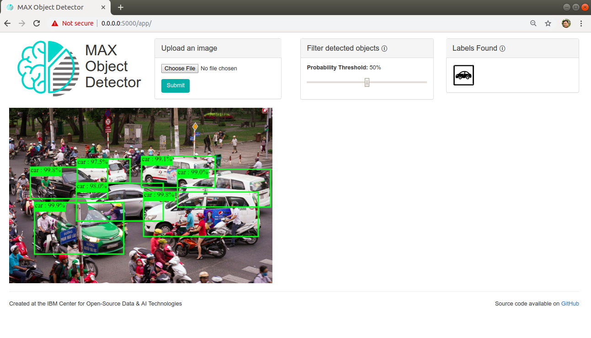

# IBM Developer Model Asset Exchange: Object Detector

This repository contains code to instantiate and deploy an object detection model as a web service in a Docker container. The input to the model is an image, and the output is a list of estimated class probabilities for the objects detected in the image. This is the first time I work with a powerful thing call *API*.

The original version is based on the [SSD Mobilenet V1 object detection model for TensorFlow](https://github.com/tensorflow/models/blob/master/research/object_detection/g3doc/detection_model_zoo.md), but I customized to use [my car detection model](https://github.com/manhitv/Object-Detection-Tensorflow).

You could follow instructions from [here](https://github.com/IBM/MAX-Object-Detector) to run the code locally or deploy the model as a web service.

If you want to use your model, just change properly two files: **config.py** and **Dockerfile** as your trained model/data. Note that you must create public links for your trained model/data in Dockerfile.

# Object Detector Web App

The latest release of the [MAX Object Detector Web App](https://github.com/IBM/MAX-Object-Detector-Web-App)
is included in the Object Detector docker image.

When the model API server is running, the web app can be accessed at `http://localhost:5000/app`
and provides interactive visualization of the bounding boxes and their related labels returned by the model.

